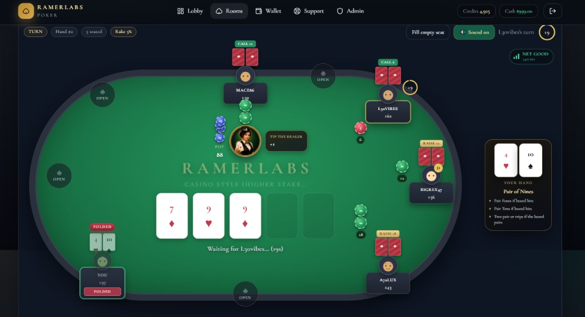

# RamerLabs Poker

Premium Texas Hold'em multiplayer platform by [RamerLabs](https://ramerlabs.com) — live tables, credits & cash wallets, bots, chat, and an admin control panel.



## Stack

- **Next.js 16** + TypeScript + Tailwind CSS
- **Prisma** + Neon PostgreSQL
- **NextAuth (Auth.js)** credentials auth
- **Ably** realtime (optional) — set `ABLY_ENABLED=false` to force polling
- Vercel-ready serverless API routes

## Features

- Public **FREE** rooms (credits) and private **REAL** rooms (invite codes)
- Full Texas Hold'em engine: shuffle, deal, blinds, streets, showdown
- Timed turns, auto-fold, tip the dealer, and seat waitlist / stand up
- Configurable bot opponents with per-table accuracy (0–100%)
- Table chat with admin enable/disable per room
- Split wallet: Credits vs Real Cash + currency switcher (USD/PHP)
- **USDT** / **GCash** deposit & withdrawal gateways
- Admin panel: tables, currencies, rake, Ably, support tickets

## Quick start

```bash
npm install
cp .env.example .env.local
# set DATABASE_URL, AUTH_SECRET, NEXTAUTH_URL
npx prisma db push
npm run db:seed
npm run dev
```

Open [http://localhost:3000](http://localhost:3000).

### Seed accounts

| Email | Password | Role |
| --- | --- | --- |
| admin@ramerlabs.com | password123 | ADMIN |
| player@ramerlabs.com | password123 | USER |

New registrations receive **1,000 credits**.

## Environment

| Variable | Purpose |
| --- | --- |
| `DATABASE_URL` | Neon Postgres connection string |
| `AUTH_SECRET` | NextAuth secret |
| `NEXTAUTH_URL` | App URL |
| `ABLY_API_KEY` | Optional Ably key fallback (Admin can override) |
| `ABLY_ENABLED` | Optional env kill-switch (`false` forces polling). Admin toggle is preferred |
| `LICENSE_SITE_URL` | Site URL used for license activate/validate (defaults to `NEXTAUTH_URL`) |
| `LICENSE_BUY_URL` | Store CTA (defaults to ramerlabs.com poker product page) |
| `LICENSE_SKIP` | `true` bypasses the license gate (local/dev only) |

Never commit `.env` / `.env.local`. Rotate any credentials that were shared in chat.

## Deploy (Vercel)

1. Push to GitHub and import the project in Vercel
2. Set the same env vars in the Vercel project
3. Build command: `prisma generate && next build` (postinstall already runs generate)
4. Run `prisma db push` / migrate against Neon before first deploy

## Scripts

| Command | Description |
| --- | --- |
| `npm run dev` | Local development server |
| `npm run build` | Production build |
| `npm run db:push` | Sync Prisma schema to the database |
| `npm run db:seed` | Seed admin, currencies, and sample rooms |

## License

Private — RamerLabs. All rights reserved.

This app is license-gated via RamerLabs License Manager. Buy a lifetime key at
[ramerlabs.com/product/ramerlabs-poker](https://ramerlabs.com/product/ramerlabs-poker/),
then activate on the lock screen. For local development only, you may set
`LICENSE_SKIP=true` in `.env.local` (never in production).

A product by [RamerLabs](https://ramerlabs.com).
